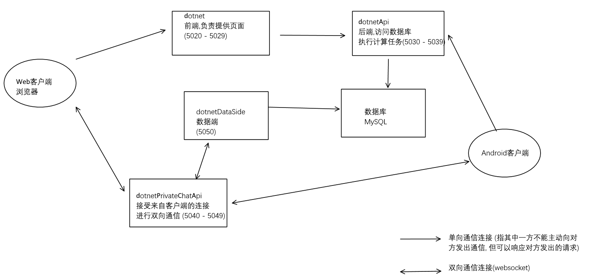

## “圈”——校友互助平台
### 一、项目简介

#### 1、项目背景
- 根据自身需求及调研结果，“考研热”、“就业难”的问题是当前社会热点。
- 为让高校学生尽快适应高校学习生活以及尽早做好自身发展规划，创建了校友互助平台。
- 通过以高年级学生为低年级学生传授经验的方式，形成“传、帮、带”的发展平台，使高校在校生利用好“人”的资源，以便高效的获得最贴合自身的经验和高年级学生的有效帮助。

### 二、项目架构



### 三、项目运行

#### 如何运行项目
1. 通过`git`拉取子模块`Kamanri` 
``` bash
git submodule update --init --recursive
```
如果本地没有安装`git`, 则
> - 在项目根目录新建文件夹`Kamanri`
> - 下载项目`https://gitee.com/ryankamanri/Kamanri.git`, 并解压至新建的文件夹中
1. 将`Circle.sql`文件导入`MySQL`数据库
2. 单击`start_all.bat`文件(仅在windows操作系统下)
3. [安卓项目地址](https://gitee.com/ryankamanri/android-final-works)